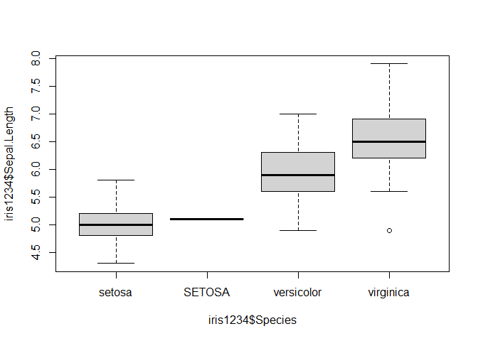

R Markdown for GitHub with Intermediate R Tutorial
================

-----

## Table of Contents

  - [R Markdown for GitHub](#markdown-vs-r-markdown)
  - [Intermediate R Tutorial](#intermediate-programming-with-r)

-----

## Markdown vs. R Markdown

This is an R Markdown document. R Markdown uses the Markdown language,
but allows for the addition of authoring HTML, PDF, and MS Word
documents with functional code snippets and actual outputs from within
the RStudio IDE.

  - For RStudio see <https://rstudio.com/>.
  - For more details on using R Markdown see
    <http://rmarkdown.rstudio.com>.

### Converting from `README.Rmd` → `README.md`

You can ***clone this repository as a template*** for your own
feature-rich `README.md` files on GitHub (and other platforms like
Bitbucket).

If you open the `README.Rmd` document for editing in RStudio and click
the **Knit** button, a normal Markdown document (`README.md`) will be
generated that includes both content as well as the output of any
embedded R code chunks within the document.

### Code and output

You can embed an R code chunk like this:

``` r
summary(cars)
```

    ##      speed           dist       
    ##  Min.   : 4.0   Min.   :  2.00  
    ##  1st Qu.:12.0   1st Qu.: 26.00  
    ##  Median :15.0   Median : 36.00  
    ##  Mean   :15.4   Mean   : 42.98  
    ##  3rd Qu.:19.0   3rd Qu.: 56.00  
    ##  Max.   :25.0   Max.   :120.00

> `cars` is one of many default example data sets in the R language.

### Images

You can also embed plots, for example:

``` r
plot(pressure)
```

<!-- -->

> The output image from this code execution will be automatically saved
> in the `.img` subdirectory.

### Reference

  - <https://stackoverflow.com/a/39816334>

[**Back to Top**](#table-of-contents)

-----

## Intermediate Programming with R

The following is an intermediate tutorial on data handling,
manipulation, processing, and reporting in the R language.

An introduction to the R language can be found here: [Introduction to
Programming (in
R)](https://github.com/atet/learn/blob/master/programming/README.md#atet--learn--programming)

### Prerequisites

1.  R language and RStudio installed locally in your development
    environment: [Instructions from
    RStudio](https://rstudio.com/products/rstudio/download/#download)
2.  Clone this repository, e.g. in CLI:

<!-- end list -->

``` console
$ git clone https://github.com/atet/rmd_tutorial.git
```

3.  Install required R packages for R Markdown support (only needs to be
    done once) and load them (needs to be done per session):

<!-- end list -->

``` r
> install.packages("knitr"); install.packages("rmarkdown"); library(knitr); library("rmarkdown")
```

4.  Ensure that your working directory is at the root of this
    repository, otherwise set it using the absolute file path:
      - You can use forward slash (‘`/`’) or escaped backslashes
        (‘`\\`’) for Windows file paths

<!-- end list -->

``` r
> getwd()
[1] "<INCORRECT_FILE_PATH>"
> setwd("<CORRECT_FILE_PATH>")
```

### Background

Everything in your R environment is an object that is stored in-memory,
i.e. you can work with as large of a data set as you have RAM (*and
swap*) on your development machine.

You can quickly find information about a function by executing a ‘`?`’
in front of the function name:

``` r
> ?getwd
```

### Loading Data

Data can be loaded directly from disk using absolute or relative paths
to current working directory:

``` r
iris1 = read.csv("./dat/iris1.csv")
iris2 = read.csv("./dat/iris2.csv")
```

..or directly from a URL:

``` r
iris3 = read.csv(url("https://raw.githubusercontent.com/atet/rmd/tutorial/dat/iris3.csv"))
iris4 = read.csv(url("https://raw.githubusercontent.com/atet/rmd/tutorial/dat/iris4.csv"))
```

### Metadata

Basic object class information and number of row and columns in a `cat`
(concatenate and print to console):

``` r
cat("The `iris1` object is of \"", class(iris1),"\" class and has ", nrow(iris1), " rows/", ncol(iris1), " columns.", sep = "")
```

    ## The `iris1` object is of "data.frame" class and has 75 rows/5 columns.

..or a summary of the object’s structure:

``` r
str(iris1)
```

    ## 'data.frame':    75 obs. of  5 variables:
    ##  $ id          : int  1 2 3 4 5 6 7 8 9 10 ...
    ##  $ Sepal.Length: num  5.1 4.9 4.7 4.6 5 5.4 4.6 5 4.4 4.9 ...
    ##  $ Sepal.Width : num  3.5 3 3.2 3.1 3.6 3.9 3.4 3.4 2.9 3.1 ...
    ##  $ Petal.Length: num  1.4 1.4 1.3 1.5 1.4 1.7 1.4 1.5 1.4 1.5 ...
    ##  $ Petal.Width : num  0.2 0.2 0.2 0.2 0.2 0.4 0.3 0.2 0.2 0.1 ...

..or a summary of the object’s data:

``` r
summary(iris1)
```

    ##        id        Sepal.Length    Sepal.Width     Petal.Length    Petal.Width   
    ##  Min.   : 1.0   Min.   :4.300   Min.   :2.000   Min.   :1.000   Min.   :0.100  
    ##  1st Qu.:19.5   1st Qu.:4.900   1st Qu.:2.950   1st Qu.:1.400   1st Qu.:0.200  
    ##  Median :38.0   Median :5.100   Median :3.200   Median :1.600   Median :0.300  
    ##  Mean   :38.0   Mean   :5.341   Mean   :3.211   Mean   :2.412   Mean   :0.612  
    ##  3rd Qu.:56.5   3rd Qu.:5.700   3rd Qu.:3.500   3rd Qu.:4.000   3rd Qu.:1.250  
    ##  Max.   :75.0   Max.   :7.000   Max.   :4.400   Max.   :4.900   Max.   :1.800

..or column and row names (row names are typically character numbers by
default):

``` r
colnames(iris1)
```

    ## [1] "id"           "Sepal.Length" "Sepal.Width"  "Petal.Length" "Petal.Width"

``` r
rownames(iris1)
```

    ##  [1] "1"  "2"  "3"  "4"  "5"  "6"  "7"  "8"  "9"  "10" "11" "12" "13" "14" "15"
    ## [16] "16" "17" "18" "19" "20" "21" "22" "23" "24" "25" "26" "27" "28" "29" "30"
    ## [31] "31" "32" "33" "34" "35" "36" "37" "38" "39" "40" "41" "42" "43" "44" "45"
    ## [46] "46" "47" "48" "49" "50" "51" "52" "53" "54" "55" "56" "57" "58" "59" "60"
    ## [61] "61" "62" "63" "64" "65" "66" "67" "68" "69" "70" "71" "72" "73" "74" "75"

### Subsetting

The `*.csv` files loaded are of object class `data.frame` in the current
environment. These are simple two-dimensional, tabular data sets like an
Excel spreadsheet with rows and columns.

You can reference an entire column from the `data.frame` as a **vector**
by using the ‘`$`’ symbol:

``` r
iris1$id
```

    ##  [1]  1  2  3  4  5  6  7  8  9 10 11 12 13 14 15 16 17 18 19 20 21 22 23 24 25
    ## [26] 26 27 28 29 30 31 32 33 34 35 36 37 38 39 40 41 42 43 44 45 46 47 48 49 50
    ## [51] 51 52 53 54 55 56 57 58 59 60 61 62 63 64 65 66 67 68 69 70 71 72 73 74 75

..or subset rows by specifying conditions before the comma in the square
brackets below:

``` r
iris1[1, ]
```

    ##   id Sepal.Length Sepal.Width Petal.Length Petal.Width
    ## 1  1          5.1         3.5          1.4         0.2

``` r
iris1[2:3, ]
```

    ##   id Sepal.Length Sepal.Width Petal.Length Petal.Width
    ## 2  2          4.9         3.0          1.4         0.2
    ## 3  3          4.7         3.2          1.3         0.2

``` r
iris1[iris1$id == 4, ]
```

    ##   id Sepal.Length Sepal.Width Petal.Length Petal.Width
    ## 4  4          4.6         3.1          1.5         0.2

..or subset columns by specifying conditions after the comma in the
square brackets below (also subsetting rows to 1:5 to limit output):

> NOTE: If you subset a single column from a `data.frame`, it could be
> returned as a vector in most cases.

``` r
iris1[1:5, 1:2]
```

    ##   id Sepal.Length
    ## 1  1          5.1
    ## 2  2          4.9
    ## 3  3          4.7
    ## 4  4          4.6
    ## 5  5          5.0

``` r
iris1[1:5, c("Sepal.Width", "Petal.Length")]
```

    ##   Sepal.Width Petal.Length
    ## 1         3.5          1.4
    ## 2         3.0          1.4
    ## 3         3.2          1.3
    ## 4         3.1          1.5
    ## 5         3.6          1.4

``` r
iris1[1:5, colnames(iris1) == "Petal.Width"]
```

    ## [1] 0.2 0.2 0.2 0.2 0.2

### Manipulation

The four data sets loaded were previously split from a larger data set,
we will stitch them all back together.

First we will concatenate rows of data together:

``` r
iris12 = rbind(iris1, iris2)
iris34 = rbind(iris3, iris4)
```

Secondly, though you could also concatenate columns together (using
`cbind`), we will `merge` using a key row `$id` to ensure that
out-of-order data is merged correctly:

``` r
iris1234 = merge(iris12, iris34, by = "id")
str(iris1234)
```

    ## 'data.frame':    150 obs. of  6 variables:
    ##  $ id          : int  1 2 3 4 5 6 7 8 9 10 ...
    ##  $ Sepal.Length: num  5.1 4.9 4.7 4.6 5 5.4 4.6 5 4.4 4.9 ...
    ##  $ Sepal.Width : num  3.5 3 3.2 3.1 3.6 3.9 3.4 3.4 2.9 3.1 ...
    ##  $ Petal.Length: num  1.4 1.4 1.3 1.5 1.4 1.7 1.4 1.5 1.4 1.5 ...
    ##  $ Petal.Width : num  0.2 0.2 0.2 0.2 0.2 0.4 0.3 0.2 0.2 0.1 ...
    ##  $ Species     : chr  "setosa" "setosa" "setosa" "setosa" ...

New columns can be added by specifying a column name that is not
currently used and populating it:

``` r
iris1234$test = paste("test", nrow(iris1234):1)
head(iris1234, n = 2)
```

    ##   id Sepal.Length Sepal.Width Petal.Length Petal.Width Species     test
    ## 1  1          5.1         3.5          1.4         0.2  setosa test 150
    ## 2  2          4.9         3.0          1.4         0.2  setosa test 149

..and existing columns can be removed:

``` r
iris1234$test = NULL
head(iris1234, n = 2)
```

    ##   id Sepal.Length Sepal.Width Petal.Length Petal.Width Species
    ## 1  1          5.1         3.5          1.4         0.2  setosa
    ## 2  2          4.9         3.0          1.4         0.2  setosa

New rows can be added with the concatenating `rbind` function above
(must have the same columns):

``` r
new_row = data.frame(id = 151, Sepal.Length = NA, Sepal.Width = NA, Petal.Length = NA, Petal.Width = NA, Species = "test")
iris1234 = rbind(iris1234, new_row)
tail(iris1234, n = 2)
```

    ##      id Sepal.Length Sepal.Width Petal.Length Petal.Width   Species
    ## 150 150          5.9           3          5.1         1.8 virginica
    ## 151 151           NA          NA           NA          NA      test

..and existing rows can be removed:

``` r
iris1234 = iris1234[iris1234$id != 151,]
tail(iris1234, n = 2)
```

    ##      id Sepal.Length Sepal.Width Petal.Length Petal.Width   Species
    ## 149 149          6.2         3.4          5.4         2.3 virginica
    ## 150 150          5.9         3.0          5.1         1.8 virginica

By combining subsetting and manipulation, very specific data can be
identified:

``` r
iris_filtered = iris1234[iris1234$Sepal.Length > 5 & iris1234$Species == "setosa", "id"]
```

..or removed:

``` r
iris_filtered = iris1234[iris1234$Sepal.Length <= 5 & iris1234$Species != "setosa", "id"]
```

..or replaced:

``` r
head(iris1234, n = 1)
```

    ##   id Sepal.Length Sepal.Width Petal.Length Petal.Width Species
    ## 1  1          5.1         3.5          1.4         0.2  setosa

``` r
iris1234[iris1234$id == "1", ]$Species = "SETOSA"
head(iris1234, n = 1)
```

    ##   id Sepal.Length Sepal.Width Petal.Length Petal.Width Species
    ## 1  1          5.1         3.5          1.4         0.2  SETOSA

### Summarization

Earlier we used the `summary()` function to quickly get information on
all data in a `data.frame`:

``` r
summary(iris1234)
```

    ##        id          Sepal.Length    Sepal.Width     Petal.Length  
    ##  Min.   :  1.00   Min.   :4.300   Min.   :2.000   Min.   :1.000  
    ##  1st Qu.: 38.25   1st Qu.:5.100   1st Qu.:2.800   1st Qu.:1.600  
    ##  Median : 75.50   Median :5.800   Median :3.000   Median :4.350  
    ##  Mean   : 75.50   Mean   :5.843   Mean   :3.057   Mean   :3.758  
    ##  3rd Qu.:112.75   3rd Qu.:6.400   3rd Qu.:3.300   3rd Qu.:5.100  
    ##  Max.   :150.00   Max.   :7.900   Max.   :4.400   Max.   :6.900  
    ##   Petal.Width      Species         
    ##  Min.   :0.100   Length:150        
    ##  1st Qu.:0.300   Class :character  
    ##  Median :1.300   Mode  :character  
    ##  Mean   :1.199                     
    ##  3rd Qu.:1.800                     
    ##  Max.   :2.500

You can calculate the same information but for specific columns of data:

``` r
min(iris1234$Sepal.Length)
```

    ## [1] 4.3

``` r
quantile(iris1234$Sepal.Length, prob = 0.25)
```

    ## 25% 
    ## 5.1

``` r
median(iris1234$Sepal.Length)
```

    ## [1] 5.8

``` r
mean(iris1234$Sepal.Length)
```

    ## [1] 5.843333

``` r
quantile(iris1234$Sepal.Length, prob = 0.75)
```

    ## 75% 
    ## 6.4

``` r
max(iris1234$Sepal.Length)
```

    ## [1] 7.9

Additionally, you can get other descriptive statistics like variance and
standard deviation:

``` r
var(iris1234$Sepal.Length)
```

    ## [1] 0.6856935

``` r
sd(iris1234$Sepal.Length)
```

    ## [1] 0.8280661

..or all percentile bins (e.g. 5% increments):

``` r
quantile(iris1234$Sepal.Length, probs = c(0, 0.05, 0.1, 0.15, 0.2, 0.25, 0.3, 0.35, 0.4, 0.45, 0.5, 0.55, 0.6, 0.65, 0.7, 0.75, 0.8, 0.85, 0.9, 0.95, 1))
```

    ##    0%    5%   10%   15%   20%   25%   30%   35%   40%   45%   50%   55%   60% 
    ## 4.300 4.600 4.800 5.000 5.000 5.100 5.270 5.500 5.600 5.700 5.800 5.900 6.100 
    ##   65%   70%   75%   80%   85%   90%   95%  100% 
    ## 6.200 6.300 6.400 6.520 6.700 6.900 7.255 7.900

``` r
quantile(iris1234$Sepal.Length, probs = seq(0, 1, 0.05))
```

    ##    0%    5%   10%   15%   20%   25%   30%   35%   40%   45%   50%   55%   60% 
    ## 4.300 4.600 4.800 5.000 5.000 5.100 5.270 5.500 5.600 5.700 5.800 5.900 6.100 
    ##   65%   70%   75%   80%   85%   90%   95%  100% 
    ## 6.200 6.300 6.400 6.520 6.700 6.900 7.255 7.900

..or tabulating counts of unique values:

``` r
table(iris1234$Species)
```

    ## 
    ##     setosa     SETOSA versicolor  virginica 
    ##         49          1         50         50

..or binning values then tabulating the bins:

``` r
table(cut(iris1234$Sepal.Length, breaks = c(0, 4, 5, 6, 7, Inf)))
```

    ## 
    ##   (0,4]   (4,5]   (5,6]   (6,7] (7,Inf] 
    ##       0      32      57      49      12

You could also see all the unique values an object contains:

``` r
unique(iris1234$Species)
```

    ## [1] "SETOSA"     "setosa"     "versicolor" "virginica"

..or even remove all duplicates from a `data.frame` (will keep the first
occurrance):

``` r
iris1234[!duplicated(iris1234$Species),]
```

    ##      id Sepal.Length Sepal.Width Petal.Length Petal.Width    Species
    ## 1     1          5.1         3.5          1.4         0.2     SETOSA
    ## 2     2          4.9         3.0          1.4         0.2     setosa
    ## 51   51          7.0         3.2          4.7         1.4 versicolor
    ## 101 101          6.3         3.3          6.0         2.5  virginica

### Visualization

Data can be quickly visualized for sanity checks or highly polished for
publication quality figures. The following are a few popular and basic
visualizations.

> NOTE: Visualizations can be saved through the RStudio GUI or
> programmatically (not shown)

#### One-Dimensional Data: Single Histogram

``` r
hist(iris1234$Sepal.Length)
```

<!-- -->

#### One-Dimensional Data: Single Density Plot

``` r
plot(density(iris1234$Sepal.Length))
```

<!-- -->

#### One-Dimensional Data: Comparative Boxplots

> NOTE: The tilde ‘`~`’ below [(a.k.a formula
> interface)](https://www.datacamp.com/community/tutorials/r-formula-tutorial#using)
> is basically saying “..where Sepal.Length *depends* on Species”

``` r
boxplot(iris1234$Sepal.Length ~ iris1234$Species)
```

<!-- -->

#### Two-Dimensional Data: Single Scatterplot

``` r
plot(iris1234$Sepal.Length, iris1234$Sepal.Width)
```

<!-- -->

#### Two-Dimensional Data: Comparative Scatterplot

``` r
# 1. Default layer, no points (default is open circles)
plot(
  iris1234$Sepal.Length,
  iris1234$Sepal.Width)
# 2. Subset out Setosa data and overlay blue points over existing black points
points(
  iris1234[iris1234$Species == "setosa" | iris1234$Species == "SETOSA",]$Sepal.Length,
  iris1234[iris1234$Species == "setosa" | iris1234$Species == "SETOSA",]$Sepal.Width,
  col = "blue")
# 3. Subset out Versicolor data and overlay red points over existing black points
points(
  iris1234[iris1234$Species == "versicolor",]$Sepal.Length,
  iris1234[iris1234$Species == "versicolor",]$Sepal.Width, col = "red")
```

<!-- -->

### Output

Any object can be saved to disk; let’s save the `data.frame` as a
`*.csv`:

``` r
write.csv(iris1234, "./dat/iris1234.csv", row.names = FALSE)
```

..or any other delimiter (e.g. semi-colons):

``` r
write.table(iris1234, "./dat/iris1234.txt", sep = ";", row.names = FALSE)
```

..or as an `*.rds` R object (default is compressed):

``` r
saveRDS(iris1234, "./dat/iris1234.rds", compress = TRUE)
```

### Protips

#### Vectorization

The R language works natively on vectors, therefore there are large
performance gains leveraging this functionality compared to looping over
data structures

Let’s create a vector of random numbers and iterate over the vector in a
loop to sum the values:

``` r
set.seed(1)
indices = 100000000 # Change me to benchmark, WARNING: 100,000,000 indices is ~800 MB of data
vc = rnorm(indices) 
system.time({
  result1 = 0
  for(i in 1:length(vc)){
    result1 = result1 + vc[i]
  }
})[3]
```

    ## elapsed 
    ##    3.93

..see how much faster leveraging native vectorization capabilities of R:

``` r
system.time({
  result2 = sum(vc)
})[3]
```

    ## elapsed 
    ##    0.14

``` r
all.equal(result1, result2)
```

    ## [1] TRUE

#### Parallelism

Multi-threading is extremely easy in R, but be mindful of RAM usage
since R’s environment will be duplicated per thread:

``` r
sleep_times = c(1,2,3,4) # Sleep times in seconds
system.time({
  results = lapply(sleep_times, function(seconds){
    Sys.sleep(seconds)
  })
})[3]
```

    ## elapsed 
    ##   10.18

> NOTE: Code below will work in Windows, MacOS, and Linux

``` r
library(parallel)
system.time({
  cluster = makePSOCKcluster( # Four localhost threads
    c("localhost","localhost","localhost","localhost"))
  results = parLapplyLB(cluster, sleep_times, function(seconds){
    Sys.sleep(seconds)
  })
  stopCluster(cluster)
})[3]
```

    ## elapsed 
    ##    4.54

> NOTE: For an introduction to the functions used below, `lapply` and
> `parLapplyLB`, please see: [Functions: Theory, Practice, and
> Applications (in R)](https://github.com/atet/learn#computer-science)

#### Visualization

As seen in [Two-Dimensional Data: Comparative
Scatterplot](#two-dimensional-data-comparative-scatterplot) above, the
concept of visualization in R is ***layering new information on existing
visuals***

Let’s break down that figure here, render the base layer:

``` r
# 1. Default layer, all points are black (default is open circles)
plot(
  iris1234$Sepal.Length,
  iris1234$Sepal.Width)
```

<!-- -->

..add a new layer with the Setosa `$Species` group in blue:

``` r
plot(
  iris1234$Sepal.Length,
  iris1234$Sepal.Width)
# 2. Subset out Setosa data and overlay blue points over existing black points
points(
  iris1234[iris1234$Species == "setosa" | iris1234$Species == "SETOSA",]$Sepal.Length,
  iris1234[iris1234$Species == "setosa" | iris1234$Species == "SETOSA",]$Sepal.Width, 
  col = "blue")
```

<!-- -->

..add a new layer with the Versicolor `$Species` group in red (which
leaves Virginica group as default black):

``` r
plot(
  iris1234$Sepal.Length,
  iris1234$Sepal.Width)
points(
  iris1234[iris1234$Species == "setosa" | iris1234$Species == "SETOSA",]$Sepal.Length,
  iris1234[iris1234$Species == "setosa" | iris1234$Species == "SETOSA",]$Sepal.Width, 
  col = "blue")
# 3. Subset out Versicolor data and overlay red points over existing black points
points(
  iris1234[iris1234$Species == "versicolor",]$Sepal.Length,
  iris1234[iris1234$Species == "versicolor",]$Sepal.Width, col = "red")
```

<!-- -->

> NOTE: For a more detailed overview of visualization in R, please see:
> [Data Visualization: Theory, Practice, and Applications (in
> R)](https://github.com/atet/learn#data-science)

[**Back to Top**](#table-of-contents)

-----

Copyright © 2020-∞
<a href="http://www.athitkao.com" target="_blank">Athit Kao</a>,
<a href="http://www.athitkao.com/tos.html" target="_blank">Terms and
Conditions</a>

-----
